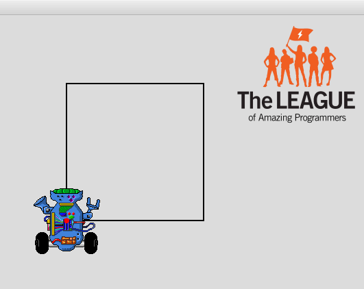
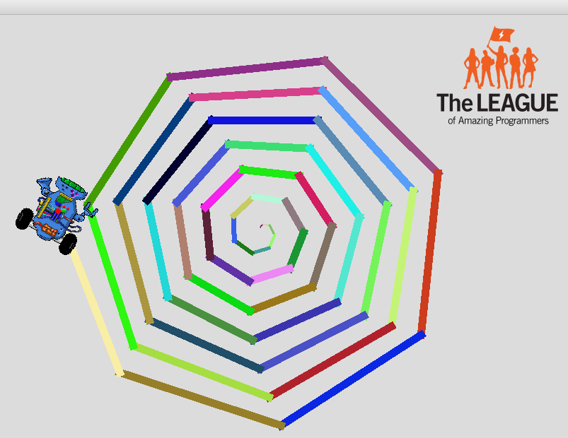
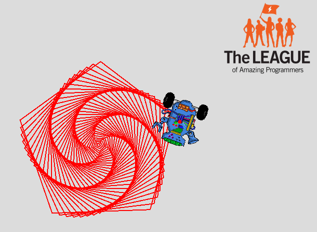
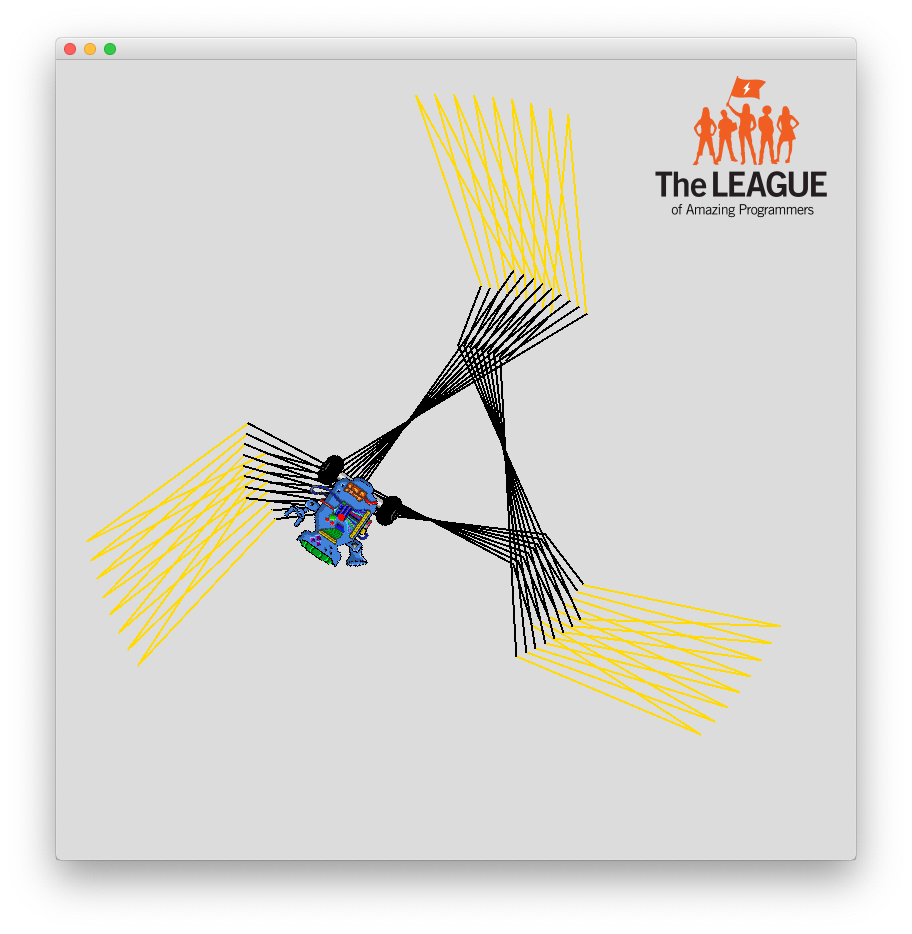

# 02 Code Flow

{{ forkrepo(fm_level, fm_module) }}

{{ reporef(fm_level, fm_module) }}

## Robot Square

{{ javaref(fm_level, fm_module,fm_lesson,fm_assignment, fm_dir) }}

### Goal:

Use a loop to draw a square using a Robot

### Steps:

1. Find the RobotSquare recipe program ( RobotSquare.java ) and open it using Eclipse.
2. Follow the instructions in the program to help you make a Robot draw a square.

## Robot Spiral

{{ javaref(fm_level, fm_module,fm_lesson,fm_assignment, fm_dir) }}

### Goal:

Use a loop to draw a spiral pattern using a Robot

### Steps:

1. Find the RobotSpiral recipe program ( RobotSpiral.java ) and open it using Eclipse.
2. Follow the instructions in the program to help you make a Robot draw a spiral pattern.

## Pentagon Crazy

{{ javaref(fm_level, fm_module,fm_lesson,fm_assignment, fm_dir) }}

### Goal:

Use int variables in a loop to draw a pentagonal pattern using a Robot

### Steps:

1. Find the Pentagon Crazy recipe program ( PentagonCrazy.java ) and open it using Eclipse.
2. Follow the instructions in the program to help you make a Robot draw a pentagonal pattern.

## Flaming Ninja Star

{{ javaref(fm_level, fm_module,fm_lesson,fm_assignment, fm_dir) }}

### Goal:

Use int variables in a loop to draw a flaming ninja star.

### Steps:

1. Find the Flaming Ninja Star recipe program ( FlamingNinjaStar.java ) and open it using Eclipse.
2. Follow the instructions in the program to draw the star.
3. The first time you run the program, it should look like this
4. After you add the color, it should look like this
5. Using a loop to repeat the pattern, the flaming star will be complete.

