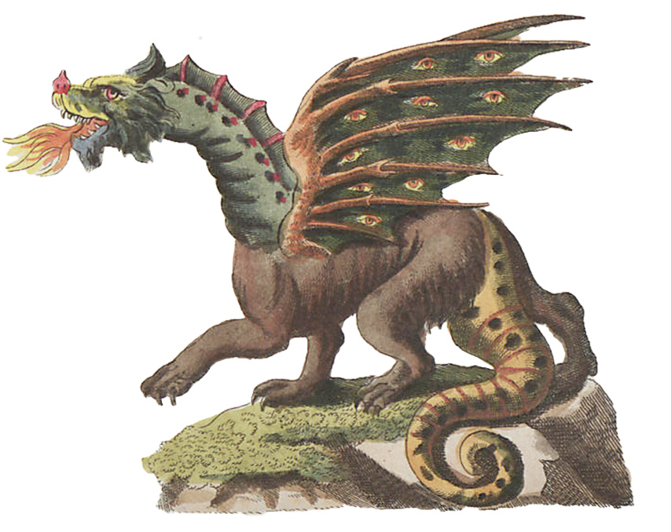

# 04 Amazing Games

{{ forkrepo(fm_level, fm_module) }}

{{ reporef(fm_level, fm_module) }}

## Scary Maze

{{ javaref(fm_level, fm_module,fm_lesson,fm_assignment, fm_dir) }}

### Goal:

Design and build a maze game

### Steps:

1. Find the Scary Maze recipe program ( ScaryMaze.java ) and open it using Eclipse.
2. Follow the instructions in the program to help you design and build a maze game.

## Dragon Fight

{{ javaref(fm_level, fm_module,fm_lesson,fm_assignment, fm_dir) }}

### Goal:

Use random numbers and pop-ups in a while loop to fight a dragon for its treasure.

### Steps:

1. Find the Dragon Fight recipe program ( DragonFight.java ) and open it using Eclipse.
2. Follow the instructions in the program to code this game.

