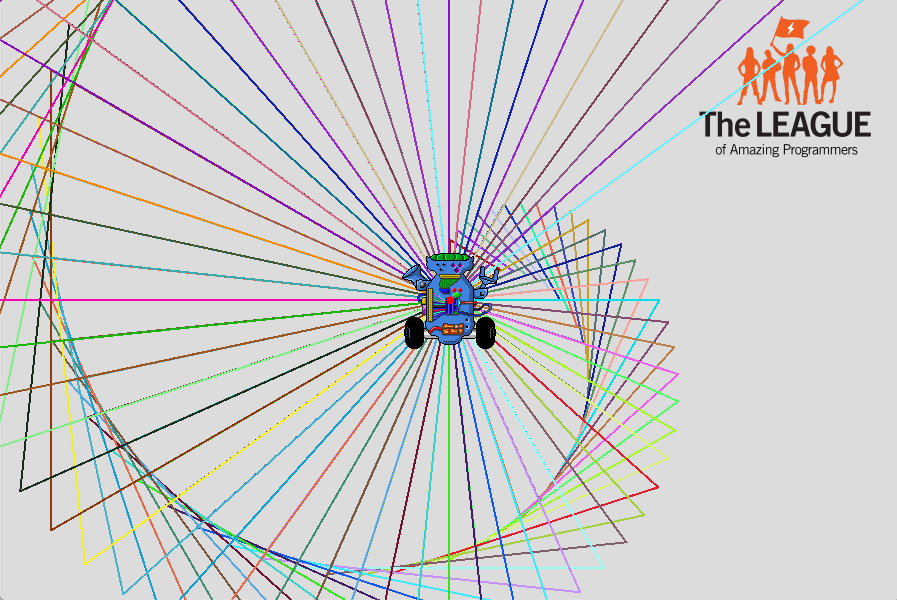

# Triangle Shell

{{ forkrepo(fm_level, fm_module) }}

{{ reporef(fm_level, fm_module) }}

{{ javaref(fm_level, fm_module,fm_lesson,fm_assignment, fm_dir) }}

## Goal:

Use int variables and a loop to draw a pattern with triangles.

## Steps:

1. Find the Triangle Shell recipe program ( TriangleShell.java ) and open it using Eclipse.
2. Follow the instructions in the program to draw the pattern.
3. The first time you run the program, it should look like this
4. After you add all the triangles, it should look something like this

