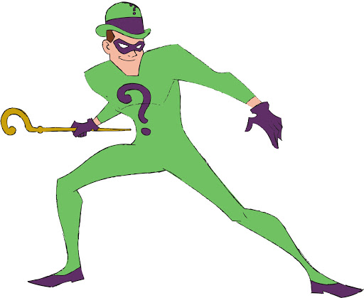

# 04 Int

{{ forkrepo(fm_level, fm_module) }}

{{ reporef(fm_level, fm_module) }}


## The Riddler

{{ javaref(fm_level, fm_module,fm_lesson,fm_assignment, fm_dir) }}


<hr/>


### Goal:

Ask the user some riddles!

### Steps:

1. Make a variable to hold the player's score.
```

int score = 0;
```
2. Ask the player a riddle. [Here](http://brainden.com/logic-riddles.htm) are some ideas.
3. If they get the answer right, pop up "correct!" and increase the score by one
```

score++;
```
4. Otherwise, tell them they are "wrong" and also tell them the correct answer
5. Add some more riddles


## 04 Int 2 Robot In Space

{{ javaref(fm_level, fm_module,fm_lesson,fm_assignment, fm_dir) }}


## Zombie Eyes

{{ javaref(fm_level, fm_module,fm_lesson,fm_assignment, fm_dir) }}


<hr/>


### Goal:

You are going to make a face with animated eyes. You could use your own face (if you have a photo) or a zombie, a cat, or whatever you like. Whatever you choose, the eyes should be prominent (large).

### Steps:

1. Find the Zombie Eyes recipe program ( zombie_eyes.pde ) and open it using Processing.
2. Drop the image of a face onto your sketch. Load it like this in the setup method:
```

PImage face = loadImage("face.jpeg");
```
3. Adjust the size of your sketch if necessary.
```

size(width, height);
```
4. Adjust the size of your image so that the size matches the sketch and draw it using the image command.
```

face.resize(width, height);
image(face, 0, 0);
```
5. Place 2 ellipses over the irises of the eyes in the draw method.
```

ellipse(x, y, width, height);
```
6. Give the irises a color with the fill command (use numbers in place of red, green, blue).
```

fill(red, green, blue);
```
7. Use mouseX and mouseY to change the color of the irises when the mouse moves.
8. Draw black pupils on top of the irises.
9. Make sure you SAVE YOUR CODE when you are done.


## Rock Ship Blastoff

{{ javaref(fm_level, fm_module,fm_lesson,fm_assignment, fm_dir) }}


<hr/>


### Goal:

The goal is to make the Rocketship blast off and move from the bottom of the screen to the top of the screen.

### Steps:

1. Find the Rocket Ship recipe program ( rocket_ship.pde ) and open it using Processing.
2. Change the code to make the rocket ship take off.
3. Optional: Add a moon and stars to the sky (see picture)
4. Make sure you SAVE YOUR CODE when you are done.


