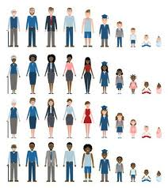
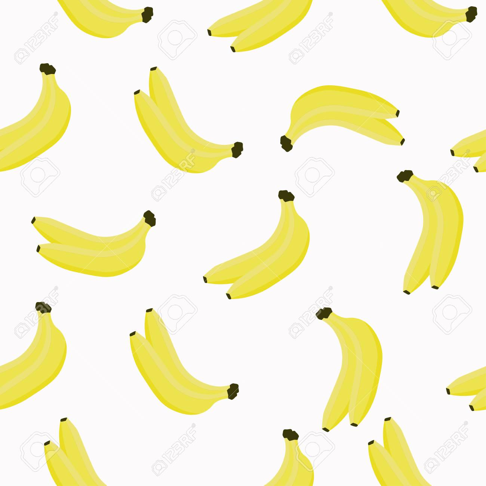

# 05 For Loops

{{ forkrepo(fm_level, fm_module) }}

{{ reporef(fm_level, fm_module) }}


## My Ages

{{ javaref(fm_level, fm_module,fm_lesson,fm_assignment, fm_dir) }}


<hr/>


### Goal:

Practice using for loops!

### Steps:

1. Using a for loop, print out all the ages you have been alive, up to your current age.


## Badgers

{{ javaref(fm_level, fm_module,fm_lesson,fm_assignment, fm_dir) }}


<hr/>


### Goal:

Print the lyrics to the
Badgers song!

### Steps:

1. Use for loops (you will need more than one) to print the following lyrics from the Badger Song.  You can only use the words “Badger”, “Mushroom” and “Snake” once each in your code.


Print 2 verses of the song as follows:


Badger, Badger, Badger, Badger, Badger, Badger, Badger,Badger, Badger,Badger, Badger, Badger

Mushroom, Mushroom

Badger, Badger, Badger,Badger, Badger, Badger, Badger,Badger, Badger, Badger, Badger, Badger

Mushroom, Mushroom

A Snake!!!


## Bananas 4eva

{{ javaref(fm_level, fm_module,fm_lesson,fm_assignment, fm_dir) }}


<hr/>


### Goal:

Practice using for loops!

### Steps:

1. Find the Bananas 4Eva recipe program ( bananas_4eva.pde ) and open it using Processing.
2. Write a for loop that prints "banana" 1000 times.
3. Make sure you SAVE YOUR CODE when you are done.


## Banana Split

{{ javaref(fm_level, fm_module,fm_lesson,fm_assignment, fm_dir) }}


<hr/>


### Goal:

Use for loops to recreate the image above!

### Steps:

1. Find the Banana Split recipe program ( banana_split.pde ) and open it using Processing.
2. Use the code below to help you print “ice cream ice cream ice cream banana” on the sketch.  However, you can only use the words "ice cream" once in your code so you'll need a loop.
```

text("word", xPos, yPos);
```
3. Make sure you SAVE YOUR CODE when you are done.


