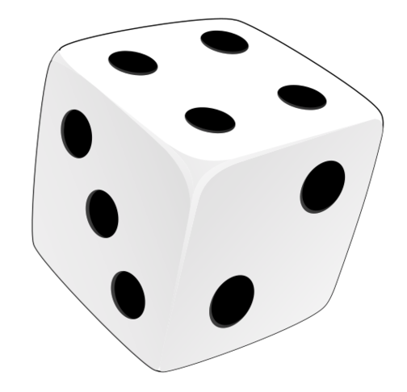
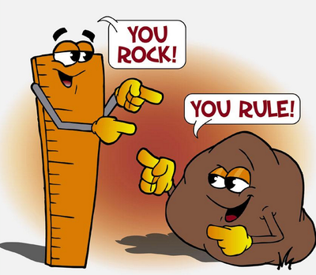
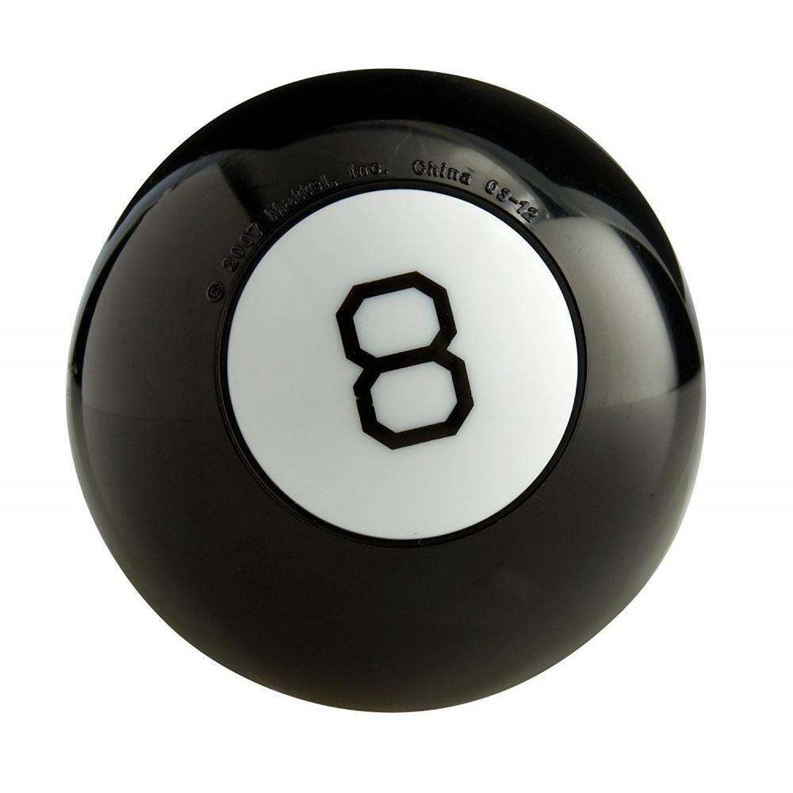
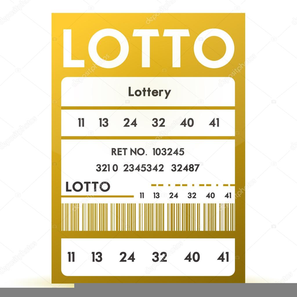

# 01 Random

{{ forkrepo(fm_level, fm_module) }}

{{ reporef(fm_level, fm_module) }}

## Intro to Random

{{ javaref(fm_level, fm_module,fm_lesson,fm_assignment, fm_dir) }}

### Goal:

Learn how to use a Random object to generate random integers within specified number ranges.

### Steps:

1. Generate a random integer without limits.
2. Generate a random positive integer with an upper limit.
3. Generate a random integer with an upper and lower (positive) limit.
4. Generate a random integer with an upper and lower (negative) limit

## Rock Paper Scissors

{{ javaref(fm_level, fm_module,fm_lesson,fm_assignment, fm_dir) }}

### Goal:

Use a Random object to generate random integers so your code can play Rock Paper Scissors with you.

### Steps:

1. Create a Random object.
2. Generate a random number to represent rock, paper, or scissors in a game.
3. Play Rock Paper Scissors against the computer to test your code.

## Dice Roll

{{ javaref(fm_level, fm_module,fm_lesson,fm_assignment, fm_dir) }}

### Goal:

Use a Random object to generate random integers so your code can roll different numbers on a dice.

### Steps:

1. Create a Random object.
2. Generate a random number between 1 and 6.
3. Change the code to display the dice image to match the number each time the "CLICK HERE TO ROLL" button is pressed.
4. Test your code to make sure all 6 sides are displayed.

## Validation

{{ javaref(fm_level, fm_module,fm_lesson,fm_assignment, fm_dir) }}

### Goal:

Use a Random object to generate random integers so your code can generate random compliments.

### Steps:

1. Create a Random object.
2. Generate a random number between 0 and 4.
3. Map each value (0-4) to a unique compliment.
4. Print a random compliment 10 times (using a loop)
5. Test your code and receive some compliments.

## Magic 8 Ball

{{ javaref(fm_level, fm_module,fm_lesson,fm_assignment, fm_dir) }}

### Goal:

Use a Random object to generate random integers so your code can generate random messages from the Magic 8 Ball.

### Steps:

1. Create a Random object.
2. Generate a random number between 0 and 3.
3. Map each value (0-3) to a unique message.
4. Test your code and receive some magic answers from the 8 ball.

## Lottery Numbers

{{ javaref(fm_level, fm_module,fm_lesson,fm_assignment, fm_dir) }}

### Goal:

Use random numbers to make a lottery ticket!

### Steps:

1. Add a new class for the Lottery Numbers recipe.
2. Get 6 random numbers to put on your lottery ticket
3. Display the selected numbers to the user in a pop-up (see below)

(All 6 random numbers must appear on the same pop-up [i.e. the user should not have to click "ok" 6 times])
4. Bonus: set the title of the pop-up to show it is a lottery ticket.

