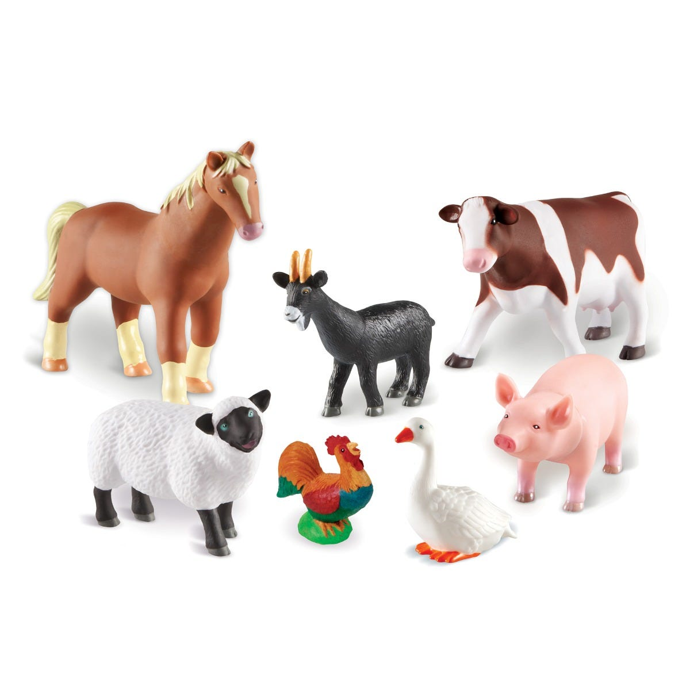
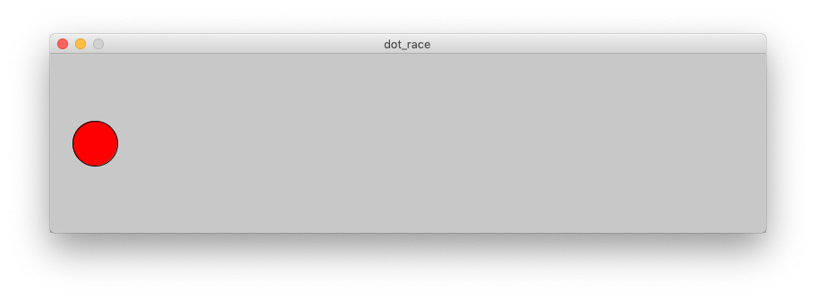
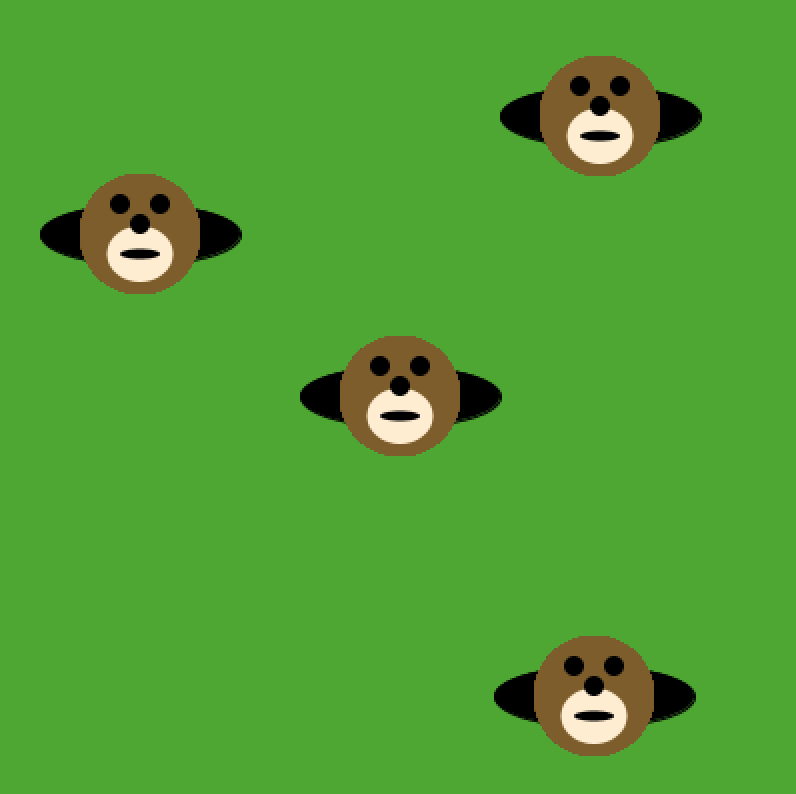
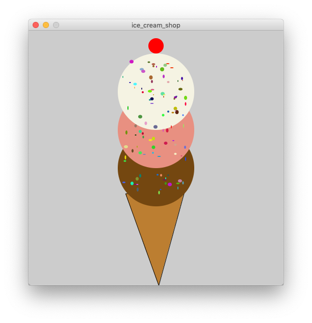
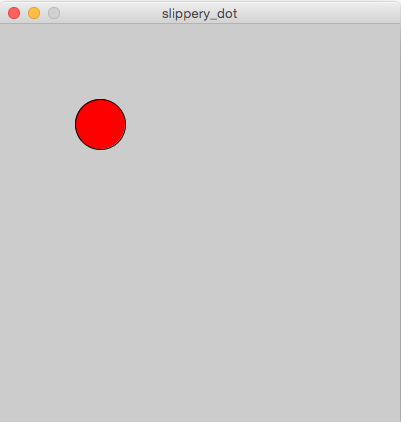

# 02 Methods

{{ forkrepo(fm_level, fm_module) }}

{{ reporef(fm_level, fm_module) }}

## Animal Farm

{{ javaref(fm_level, fm_module,fm_lesson,fm_assignment, fm_dir) }}

### Goal:

Method calls. Call a method that shows an image and makes the sound of an animal as selected by the user in a pop-up.

### Steps:

1. Ask the user to enter the name of an animal on this farm.
2. Use if statements to call the method that matches the animal they chose.
3. Loop the program so the user can choose more than one time.
4. Test your code to make sure all animal choices work correctly.
5. What happens if the user does not enter the name of an animal on the farm?

## Safe Cracker

{{ javaref(fm_level, fm_module,fm_lesson,fm_assignment, fm_dir) }}

### Goal:

Method calls - call a method passing a parameter. Your mission: use the tryCode method to crack the safe by trying all possible numbers.

### Steps:

1. Create a for loop that will repeat until the program ends.
2. Inside the loop, call the tryCode method using the for loop variable for the code.
3. The tryCode method will end the program when the correct code is guessed.
4. Run the program and see all the guesses being printed to the console.
5. Bonus: Can you change the loop so that the safe will be cracked more quickly?

## Dot Race

{{ javaref(fm_level, fm_module,fm_lesson,fm_assignment, fm_dir) }}

### Goal:

Make the dot move across the screen when you press the mouse.

### Steps:

1. Find the Dot Race recipe program ( dot_race.pde ) and open it using Processing.
2. Follow the instructions in the code to make a dot race across the screen.
3. Make sure you SAVE YOUR CODE when you are done.

## Moles in Holes

{{ javaref(fm_level, fm_module,fm_lesson,fm_assignment, fm_dir) }}

### Goal:

Put the moles in their holes!

### Steps:

1. Find the Moles In Holes recipe program ( moles_in_holes.pde ) and open it using Processing.
2. Follow the instructions in the code to put moles in the holes.
3. Make sure you SAVE YOUR CODE when you are done.

## Ice Cream Shop

{{ javaref(fm_level, fm_module,fm_lesson,fm_assignment, fm_dir) }}

### Goal:

Make an ice cream cone!

### Steps:

1. Find the Ice Cream Shop recipe program ( ice_cream_shop.pde ) and open it using Processing.
2. Follow the instructions in the code to make a delicious ice cream cone with sprinkles.
3. Make sure you SAVE YOUR CODE when you are done.

## Slippery Dot

{{ javaref(fm_level, fm_module,fm_lesson,fm_assignment, fm_dir) }}

### Goal:

Make a slippery dot!

### Steps:

1. Find the Slippery Dot recipe program ( slippery_dot.pde ) and open it using Processing.
2. Follow the instructions in the code to make a dot slide away each time you click on it.
3. Make sure you SAVE YOUR CODE when you are done.

