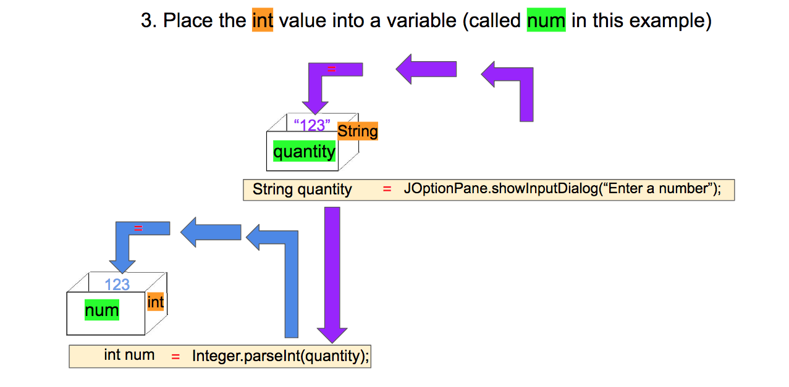

# 03 String Conversion

{{ forkrepo(fm_level, fm_module) }}

{{ reporef(fm_level, fm_module) }}

## Converting a String to an int

{{ javaref(fm_level, fm_module,fm_lesson,fm_assignment, fm_dir) }}

## Strings Cannot Add

{{ javaref(fm_level, fm_module,fm_lesson,fm_assignment, fm_dir) }}

### Goal:

Learn how the + operator works differently with Strings and numbers. Learn how to convert String objects to numbers when math operations are needed.

### Steps:

1. Follow all the instructions in the main method.
2. Observe how the + operator joins Strings to produce a new (longer) String.
3. Use the Integer.parseInt() method to convert Strings to numbers.
4. Observe how the + operator adds numbers to produce a sum.

## Roller Coaster

{{ javaref(fm_level, fm_module,fm_lesson,fm_assignment, fm_dir) }}

### Goal:

Check if a person is tall enough to ride the roller coaster!

### Steps:

1. Ask the user what height they are (in inches)
2. If they are 48" or taller, tell them they can go on the coaster alone.
3. If they are between 42" and 47" tall, tell them they need to ride with someone else.
4. If they are less than 42" tall, tell them they need to grow more.

## Voting Booth

{{ javaref(fm_level, fm_module,fm_lesson,fm_assignment, fm_dir) }}

### Goal:

Check if a person is old enough to vote!

### Steps:

1. Ask the user how old they are (in years)
2. If they are over 18, ask them who the next president should be
3. If they are younger, tell them nobody cares what they think

