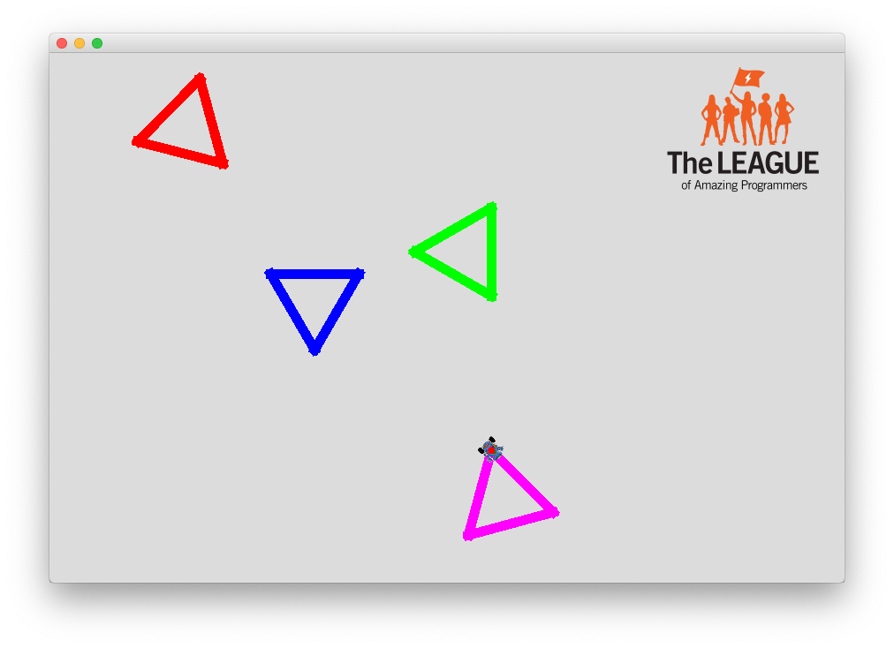
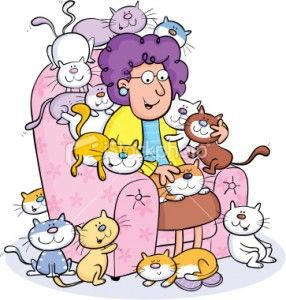
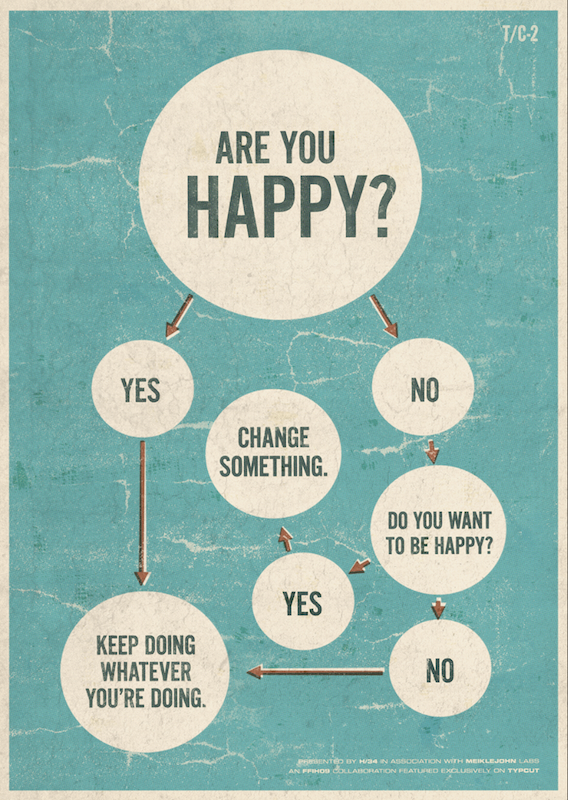

# 01 Else If

{{ forkrepo(fm_level, fm_module) }}

{{ reporef(fm_level, fm_module) }}

## Robot Color Chooser

{{ javaref(fm_level, fm_module,fm_lesson,fm_assignment, fm_dir) }}

### Goal:

Use if and else if statements to set a Robot's pen to a chosen color before drawing a shape.

### Steps:

1. Ask the user to choose a color.
2. Set the Robot's pen to the chosen color.
3. Have the Robot draw a shape.
4. Repeat the above in a loop to test all the supported colors.
5. Don't forget to use an else statement in case the user enters an unrecognized color.

## Crazy Cat Lady

{{ javaref(fm_level, fm_module,fm_lesson,fm_assignment, fm_dir) }}

### Goal:

Use if and else if statements to provide different responses to a user based on how they answer the question, "How many cats do you have?".

### Steps:

1. Ask the user how many cats they have.
2. Convert their answer into a number (int).
3. If they have 3 or more cats, they might be a crazy cat lady.
4. If they have less than 3 cats AND more than 0 cats, they are a cat lover.
5. If they have 0 cats, maybe they have a different pet.

## High Low Game

{{ javaref(fm_level, fm_module,fm_lesson,fm_assignment, fm_dir) }}

### Goal:

Use if and else if statements in a loop until the user correctly guesses the secret number in a high low game.

### Steps:

1. Get a random number between 1 and 100. Hint: use a Random object
2. Ask the user to guess what the number is.
3. If their guess is correct, tell them they won and end the game.
4. If their guess is too high, tell them it is too high.
5. If their guess is too low, tell them it is too low.
6. Use a for loop to repeat the above code 10 times. If they don't find the number after 10 tries, tell them they lost the game and tell them the number.

## Are You Happy?

{{ javaref(fm_level, fm_module,fm_lesson,fm_assignment, fm_dir) }}

### Goal:

Create a program that mimics the chart above using if and else if statements.

### Steps:

1. Use JOptionPanes and if / else if /else statements to recreate [this chart](images/AreYouHappy.png).

## Choose Your Own Adventure

{{ javaref(fm_level, fm_module,fm_lesson,fm_assignment, fm_dir) }}

### Goal:

Tell the user a story, but give them options so they can decide the path of the plot.

### Steps:

1. Use JOptionPanes, if statements, and your imagination to make an interesting story.

