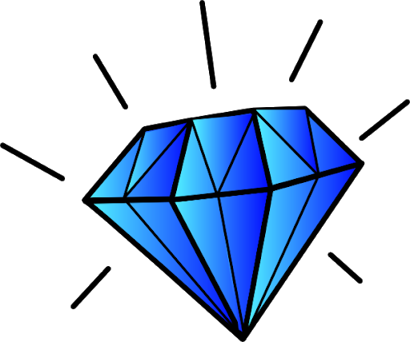
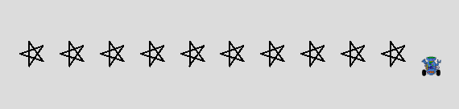

# 02 Loop Variables

{{ forkrepo(fm_level, fm_module) }}

{{ reporef(fm_level, fm_module) }}

## Years Alive

{{ javaref(fm_level, fm_module,fm_lesson,fm_assignment, fm_dir) }}

### Goal:

Print out all the years you have been alive (e.g. 2005, 2006, etc).	Use a for loop and the for loop variable should be the year

### Steps:

1. Use a for loop to print out all of the years you have been alive. Use the for loop variable in your print statement.

## Shiny Objects

{{ javaref(fm_level, fm_module,fm_lesson,fm_assignment, fm_dir) }}

### Goal:

Use input from a user to control the number of repetitions of a for loop.

### Steps:

1. Call the playMisterZee method. Run the program to make sure it works.
2. Ask the user how many shiny objects they would like
3. Use a for loop that repeats the method call for as many times as the user specified.

## Robot Walk of Fame

{{ javaref(fm_level, fm_module,fm_lesson,fm_assignment, fm_dir) }}

### Goal:

Use a for loop to make a robot draw a line of stars.

### Steps:

1. Create a Robot and place it at the left of the window.
2. Write code so the Robot draws a 5-point star (Hint: turn angle will be 144)
3. Use a for loop to repeat the above code so a line of stars is drawn across the window (see image).

## 99 Bottles

{{ javaref(fm_level, fm_module,fm_lesson,fm_assignment, fm_dir) }}

### Description

Print the words to the "99 bottles" song in a for loop.
99 bottles of beer on the wall, 99 bottles of beer.
Take one down and pass it around, 98 bottles of beer on the wall.
98 bottles of beer on the wall, 98 bottles of beer.
Take one down and pass it around, 97 bottles of beer on the wall.
...
1 bottle of beer on the wall, 1 bottle of beer.
Take one down and pass it around, no more bottles of beer on the wall.
No more bottles of beer on the wall, no more bottles of beer.
Go to the store and buy some more, 99 bottles of beer on the wall.

### Instructions

1. Find the 99 Bottles recipe program ( bottles.pde ) and open it using Processing.
2. You can find help for printing the lyrics to this song [here](https://academickids.com/encyclopedia/index.php/99_Bottles_of_Beer).
3. Do not repeat any of the lyrics in your code - use a for loop!
4. Look out for the changes you will need to make to the lyrics when you get down to 1 or zero
bottles.

