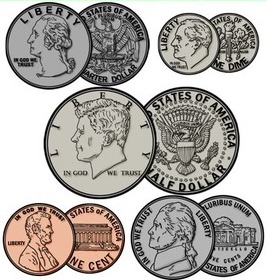

# 01 Double

{{ forkrepo(fm_level, fm_module) }}

{{ reporef(fm_level, fm_module) }}

## Change Calculator

{{ javaref(fm_level, fm_module,fm_lesson,fm_assignment, fm_dir) }}

### Goal:

Use the variable type double to store decimal values and calculate the value of the change (coins) the user has.

### Steps:

1. Ask the user how many nickels they have.
2. Multiply the number of nickels by 0.05 to calculate the dollar value of the nickels (i.e. it will be a decimal).
3. Repeat the above steps for dimes (multiply by 0.10) and quarters (multiply by 0.25).
4. Now calculate the total value of the money and tell the user how much they have in dollars and cents format:   e.g.  $3.75

## Test Scores

{{ javaref(fm_level, fm_module,fm_lesson,fm_assignment, fm_dir) }}

### Goal:

Tell the user their grade! Use double variables to allow for decimals,

### Steps:

1. Write code to ask the user for their test score.

Your program MUST allow the user to enter a test score that has a DECIMAL, e.g. 75.5
2. Give them a different message according to their score.

Example, for a good score: "Wow! You must have studied really hard for that test!"

HINT: Think about how you would convert a String to an int and use SIMILAR code to convert their test score to a double.

