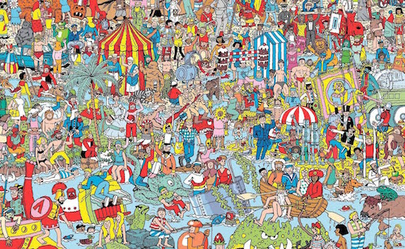

# 02 Boolean

{{ forkrepo(fm_level, fm_module) }}

{{ reporef(fm_level, fm_module) }}


## 02 Boolean 1 Sleepy Head

{{ javaref(fm_level, fm_module,fm_lesson,fm_assignment, fm_dir) }}

## 02 Boolean 2 Star Student

{{ javaref(fm_level, fm_module,fm_lesson,fm_assignment, fm_dir) }}

## 02 Boolean 3 Game Over

{{ javaref(fm_level, fm_module,fm_lesson,fm_assignment, fm_dir) }}

## 02 Boolean 4 Red Square

{{ javaref(fm_level, fm_module,fm_lesson,fm_assignment, fm_dir) }}


## Googly Eyes

{{ javaref(fm_level, fm_module,fm_lesson,fm_assignment, fm_dir) }}


<hr/>


### Goal:

You’re going to draw a face with eyes that will follow the mouse!

### Steps:

1. Find the Googly Eyes recipe program in Eclipse.
2. Find an image on the internet and copy it to the /images folder. It can be anything as long as it has large eyes!
3. On line 1 of your program (outside of the methods) declare a variable for the image:
```
   PImage face;
```
4. In your setup() method, import your image using the following code:
```

    face = loadImage(“face.jpg”);
```
5. If you need to, change the code you just entered so that "face.jpg" matches the name of your picture.
6. Set the size of your window and the size of your image to be the same by entering the following code in the setup method.
```
    size(800,600);
    face.resize(width,height);
```
7. In the draw() method, place a white ellipse over the left eye of your image.
HINT: To find out where to put it, add code to print the mouseX and mouseY where you click the mouse.
8. Now add a pupil (the black part) to the left eye earlier.
9. Use mouseX and mouseY to move the left pupil where the mouse moves.
10. Add a white ellipse over the right eye using the same technique used for the left eye.
11. Add a right pupil and make it move by using mouseX + [distance from left eye] and mouseY + [distance from left eye].
12. Here’s the tricky part: stop the pupils from going outside of the white circles!  To do this, imagine a rectangle that the pupil should stay within.  When mouseX and mouseY goes outside of these bounds, set it back to the boundary.  Put this code before you draw the pupils.
13. Make sure you SAVE YOUR CODE when you are done.


## Where's Waldo?

{{ javaref(fm_level, fm_module,fm_lesson,fm_assignment, fm_dir) }}


<hr/>


### Goal:

Make a program where the user has to find Waldo!

### Steps:

1. Find the Where's Waldo recipe program in Eclipse.
2. Find a Where's Waldo picture and add it to the /images folder.
3. Follow the instructions in the code to play a sound when the user finds Waldo!
4. Make sure you SAVE YOUR CODE when you are done.


