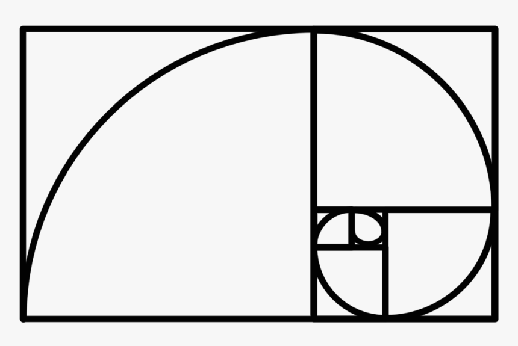

# 01 Algorithms

{{ forkrepo(fm_level, fm_module) }}

{{ reporef(fm_level, fm_module) }}

## Prime or Not

{{ javaref(fm_level, fm_module,fm_lesson,fm_assignment, fm_dir) }}

### Goal:

Ask the user for a number, then tell them if the number is prime!
A prime number is a number that is only divisible by 1 and itself.

### Steps:

1. Ask the user for a number (JOptionPane).
2. Use a for loop, if statement, and modulo to find if the number is prime.
3. If the number is divisible by any number other than 1 or itself, the number is not prime.

## Fibonacci

{{ javaref(fm_level, fm_module,fm_lesson,fm_assignment, fm_dir) }}

### Goal:

Print out the first 12 numbers of the fibonacci sequence.

### Steps:

1. There is more than one way to code a solution to this. The following steps give you some guidelines for one of them.
2. Declare and initialize three int variables: number1, number2, and sum.
3. Initialize number1 and number2 to the first two numbers of the fibonacci sequence (0 and 1) and print both numbers.
4. Use a for loop that calculates the sum of the two numbers and prints it. The for loop should repeat 10 times.
5. Now try to figure out how to change the variables before the for loop repeats so the sequence of numbers is correct.

## Goofy Names

{{ javaref(fm_level, fm_module,fm_lesson,fm_assignment, fm_dir) }}

GoOfY NaMeS

### Goal:

Write an algorithm to change a String into a "goofy" version.

### Steps:

1. Ask the user to enter their name.
2. Use a loop to alternately modify each character of the name into uppercase and lowercase letters until a new "goofy" representation of their name has been constructed.

For example, if they enter their name as Alexander Hamilton

their goofy name will be AlExAnDeR HaMiLtOn
3. Show the user the goofy version of their name in a pop-up.

