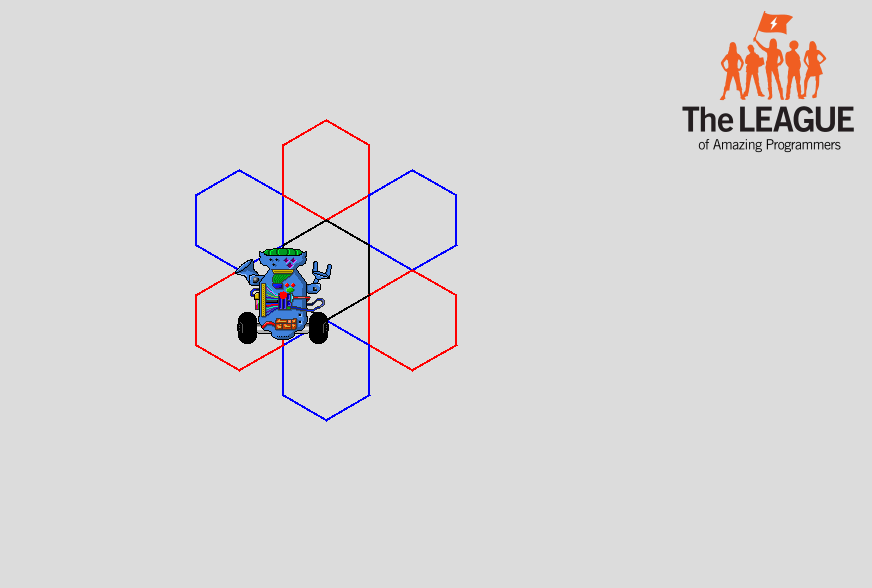
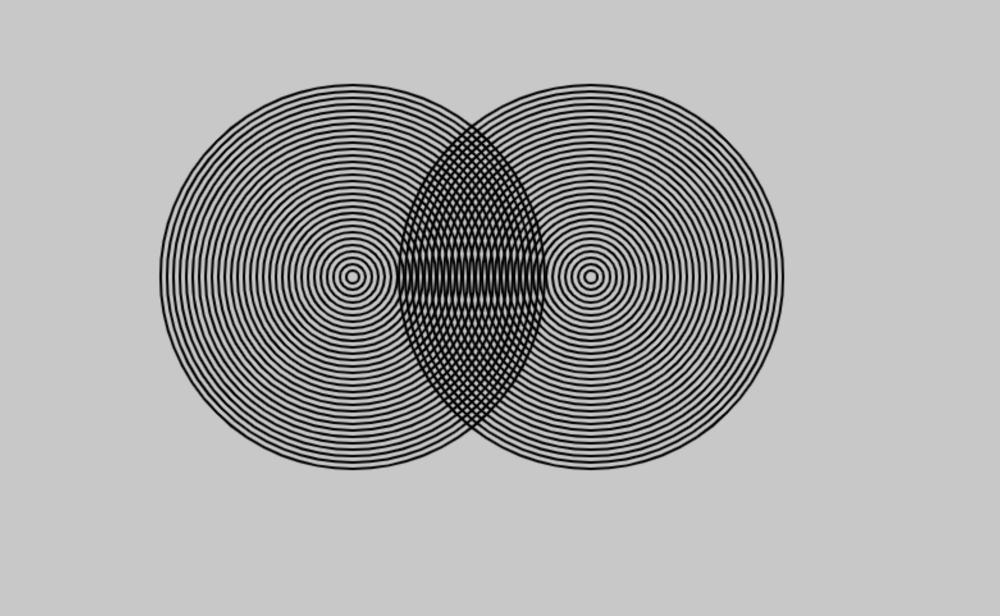

# 02 Nested Loops

{{ forkrepo(fm_level, fm_module) }}

{{ reporef(fm_level, fm_module) }}

## Snowflake

{{ javaref(fm_level, fm_module,fm_lesson,fm_assignment, fm_dir) }}

### Goal:

Use nested for loops to draw a multi-colored snowflake.

### Steps:

1. This recipe introduces using nested for loops (where one for loop is inside another for loop).
2. Follow the instructions in the code to complete this recipe.
3. When complete the Robot should draw the pattern shown here.

## Amazing Rings

{{ javaref(fm_level, fm_module,fm_lesson,fm_assignment, fm_dir) }}

### Goal:

Use Processing to make this using for loops and if statements.

### Steps:

1. This recipe practices using for loops and if statements.
2. Find the Amazing Rings recipe program in Eclipse.
3. Follow the instructions in the code to make the rings move from side to side in the sketch.
4. Make sure you SAVE YOUR CODE when you are done.

## For Loop Gauntlet

{{ javaref(fm_level, fm_module,fm_lesson,fm_assignment, fm_dir) }}

The goal of this assignment is to make you a master of utilizing for loops. Complete all the for loop challenges on the paper. Please read each challenge carefully and make sure that your for loops display exactly what is asked. If you finish them all, try the bonus challenge.

#### Single For-Loops

Write a for loop to do each the following:
1. Display all numbers from 0 to 100
2. Display all numbers from 100 to 0
3. Display all even numbers from 2 to 100
4. Display all odd numbers from 1 to 99
5. Display all numbers from 1 to 500. If the number is odd, print “odd” next to the number. If the number is even, print “even” next to the number.
Eg:
1 is odd
2 is even
3 is odd
4 is even
5 is odd...etc.
6. Display all multiples of 7 from 0 to 777.
7. Print all the years you were alive and how old you were in each. e.g. “In 1979, i was 2 years old.” (for a really old person)

#### Nested For-Loops

Write nested for loops (a for loop inside another for loop) to do the following:

1. Display this output:
0  0
0  1
0  2
1  0
1  1
1  2
2  0
2  1
2  2
2. Display the numbers 1 through 9 in a 3x3 square grid like this:
1  2  3
4  5  6
7  8  9
3. Display the numbers 1 through 100 in a 10x10 square grid.
4. Display the following output:
*
*  *
*  *  *
*  *  *  *
*  *  *  *  *
*  *  *  *  *  *

#### **Bonus**

Write a for loop that counts down from 100 to 0. However, the for loop must start with for(int i = 0;  and you may NOT have any code ABOVE your for loop.
