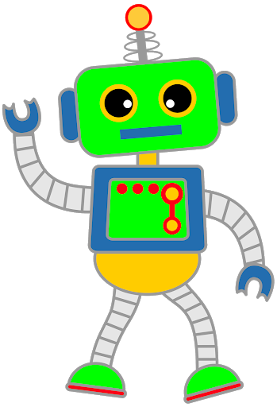
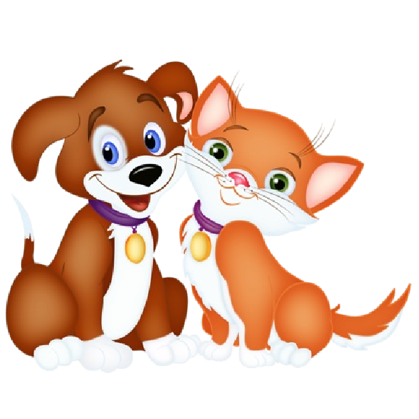

# 03 Method Writing

{{ forkrepo(fm_level, fm_module) }}

{{ reporef(fm_level, fm_module) }}

## 03 Method Writing 1 Intro To Methods

{{ javaref(fm_level, fm_module,fm_lesson,fm_assignment, fm_dir) }}

## Obedient Robot

{{ javaref(fm_level, fm_module,fm_lesson,fm_assignment, fm_dir) }}

### Goal:

Make an obedient robot that will obey commands to draw shapes.

### Steps:

1. This recipe practices writing and calling void methods.
2. Make a new class, create a main method, and show the robot.
3. Have the robot draw a square.
4. Put this code into a drawSquare() method.
5. Have the robot draw a triangle.
6. Put this code into a drawTriangle() method.
7. Have the robot draw a circle.
8. Put this code into a drawCircle() method.
9. Ask the user which shape they want. Draw the appropriate shape depending on their answer (call the right method).
10. Ask the user which color they want. Give them some choices so you don't have to accomodate every possible color. Color the the shape depending on their answer.

## Happy Pet

{{ javaref(fm_level, fm_module,fm_lesson,fm_assignment, fm_dir) }}

### Goal:

Write methods to represent the activities that will make the user's pet happy.

### Steps:

1. Ask the user to enter the type of pet they want (give them a few choices).
2. Use a loop (maybe a while loop?) to keep offering interactions with their pet until the desired pet happiness level has been reached. Examples of activities are:   Feed, Walk, Play
3. Write a method for each of the pet activities offered. Each activity should increase (or decrease) the pet's happiness level by a different amount, depending on the kind of pet they have. For example, a fish might not enjoy a walk!

## 03 Method Writing 4 Calculator

{{ javaref(fm_level, fm_module,fm_lesson,fm_assignment, fm_dir) }}

